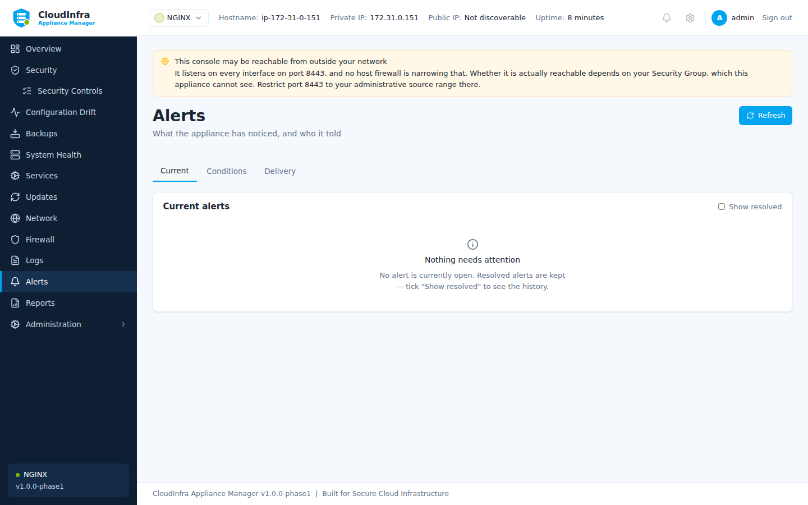

# Alerts

Alerts tell you when the appliance notices something, without you having to be looking at it.

## What raises one

| | |
|---|---|
| A security control starts failing | Critical controls raise a critical alert |
| A remediation fails or is rolled back | |
| Configuration drift is detected | |
| A watched service stops or fails | |
| Disk, memory or CPU crosses a threshold | |
| A backup or restore fails | |
| Security updates become available | |

Thresholds use hysteresis: an alert clears at a lower level than it fires at, so a value
sitting on the boundary does not produce a stream of identical alerts.


/// caption
What the appliance has noticed, and who it told.
///

## Managing them

**Acknowledge** records that somebody has seen it. **Resolve** closes it. Both are recorded
in the audit log with who did it.

Repeated occurrences of the same condition are deduplicated rather than listed again.

## Email delivery

**Alerts → Channels** configures SMTP.

| Field | Notes |
|---|---|
| Host, port | Your mail server |
| Username, password | Optional |
| From, To | Addresses |
| StartTLS | Recommended |
| Allow insecure | Only for a trusted relay on localhost |

**Send test** delivers immediately, so you find out now rather than during an incident. It
works before **Send notifications** is switched on: try the settings first, then turn
delivery on.

### Which authentication the appliance uses

It uses whichever mechanism your server advertises — PLAIN where it is offered, LOGIN
otherwise. OAuth2 (XOAUTH2) is not supported.

For **Microsoft 365** that means SMTP AUTH has to be enabled for the mailbox, and an account
with multi-factor authentication needs an app password rather than the account password. If
those are not in place, Microsoft answers with `535 5.7.3 Authentication unsuccessful` or
`5.7.139 SMTP AUTH is disabled for the Mailbox`, and the console shows you which setting it
is talking about.

| Provider | Host | Port | STARTTLS | Notes |
|---|---|---|---|---|
| Microsoft 365 | `smtp.office365.com` | 587 | Yes | Authenticated SMTP enabled for the mailbox; app password if MFA is on |
| Google Workspace | `smtp.gmail.com` | 587 | Yes | App password required |
| Amazon SES | `email-smtp.<region>.amazonaws.com` | 587 | Yes | SMTP credentials, not your AWS keys |
| A relay on this host | `127.0.0.1` | 25 | No | The one case for **Allow insecure** |

### A mail server with its own certificate authority

STARTTLS verifies the mail server's certificate against the appliance's trust store. An
internal mail server using a private CA is rejected with
`x509: certificate signed by unknown authority` until that CA is trusted:

```bash
sudo cp your-ca.crt /usr/local/share/ca-certificates/your-ca.crt
sudo update-ca-certificates
sudo systemctl restart cloudinfra-manager
```

The restart is required: the trust store is read once when the console starts.

There is deliberately no "ignore certificate errors" option. Trusting your own CA is a
better answer than accepting any certificate, and it is the same amount of work.

### Testing without a mail server

If you want to prove delivery works before pointing the appliance at your production mail
server, run a mail server that only collects messages.

[Mailpit](https://mailpit.axllent.org/) is a single binary with a web interface, and it
supports STARTTLS and authentication, so it exercises the same path a real server does:

```bash
# On the appliance, or anywhere it can reach
curl -sL -o mailpit.tar.gz \
  https://github.com/axllent/mailpit/releases/latest/download/mailpit-linux-amd64.tar.gz
tar xzf mailpit.tar.gz mailpit && sudo install -m0755 mailpit /usr/local/bin/mailpit

printf 'appliance:a-test-password\n' | sudo tee /etc/mailpit-auth >/dev/null
sudo chmod 0600 /etc/mailpit-auth

# Bound to loopback: this is a test tool and it holds every message sent to it
mailpit --smtp 127.0.0.1:1025 --listen 127.0.0.1:8025 --smtp-auth-file /etc/mailpit-auth \
        --smtp-auth-allow-insecure
```

Point the appliance at `127.0.0.1` port `1025`, username `appliance`, tick **Allow
credentials over an unencrypted connection** (it is loopback, and Mailpit here has no
certificate), and press **Send test**.

Read what arrived over an SSH tunnel, so nothing is exposed:

```bash
ssh -L 8025:127.0.0.1:8025 ubuntu@<appliance-address>
# then open http://127.0.0.1:8025
```

To exercise STARTTLS and certificate verification as well, give Mailpit a certificate
(`--smtp-tls-cert`, `--smtp-tls-key`, `--smtp-require-starttls`) and trust its CA as above.

Alternatives, if you would rather not run one: [Mailtrap](https://mailtrap.io/) and similar
services give you a hosted inbox with SMTP credentials, and work the same way from the
appliance's point of view.

When you are finished, stop Mailpit and set the channel back to your real mail server. The
password is not shown once stored, so re-enter it when you change the server.

The stored password is never returned to the console. Once set, the interface shows that a
password exists, not what it is.

!!! note "Credentials in alert emails"

    Alert messages are redacted like everything else, and the appliance's own SMTP password
    never appears in one. But an alert may quote a configuration line, so treat the
    destination mailbox as somewhere appliance detail ends up.
