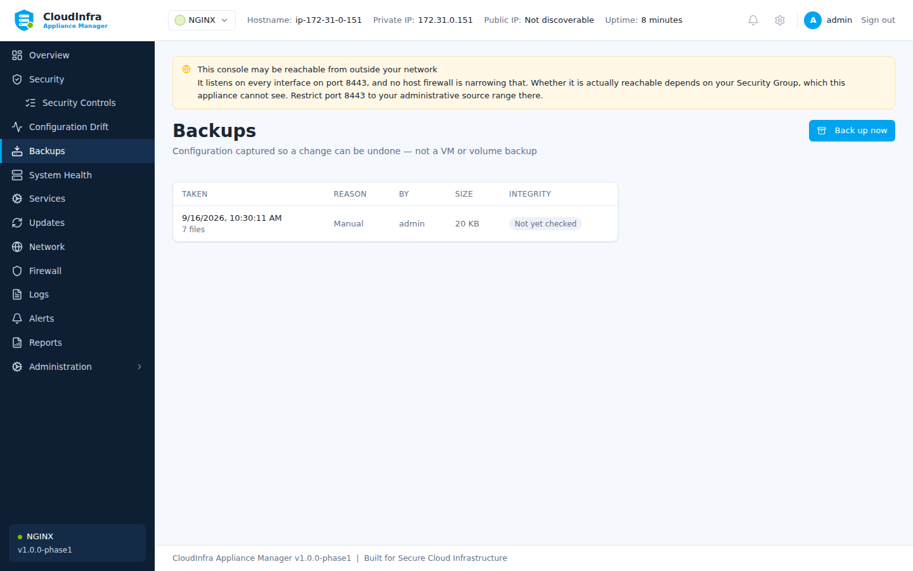

# Backups and restore

!!! warning "These are configuration backups, not VM backups"

    A backup here captures the configuration files the appliance manages — enough to undo a
    change, not enough to rebuild a machine. Use EBS snapshots or your own backup product
    for that.

## When backups happen

| Reason | When |
|---|---|
| **Pre-change** | Automatically, before any remediation |
| **Pre-restore** | Automatically, before restoring another backup over the current state |
| **Manual** | When you select **Take backup** |
| **Scheduled** | On the configured schedule |

/// caption
Each row opens to show exactly which files the backup holds and offers a restore.
///

## What is captured

Select any backup to see exactly which files it holds, their sizes, and their state at the
time.

Three things worth understanding in that list:

**A file that did not exist is recorded as absent.** Restoring it means deleting whatever is
there now, not writing an empty file.

**Some files are captured but never written back.** `/etc/fstab` and `/etc/sysctl.conf` are
recorded for the record and marked *"a restore does not write this file"*. A stale fstab
restored onto a running machine can leave one that will not boot, so the appliance keeps a
copy and declines to put it back.

**A file reached through a symlink shows where it came from.** NGINX enables a site by
linking `sites-enabled` at `sites-available`, so the backup captures the target and records
the link that led to it.

## Verifying

**Check integrity** re-reads the stored files and compares them against the digests recorded
when the backup was taken. A backup nobody verified is a backup nobody knows is intact.

The appliance verifies automatically before restoring from one.

## Restoring

**Restore** writes the captured files back. Before it does, it takes a backup of the current
state — so restoring the wrong archive is itself undoable.

The job reports how many files were written and names any that were refused. A restore that
reported plain success while silently skipping files would leave you believing a file had
been put back when it had not.

## Retention

Backups are pruned on a schedule. **Pin** any backup you want kept regardless — a known-good
configuration before a major change, for instance.
