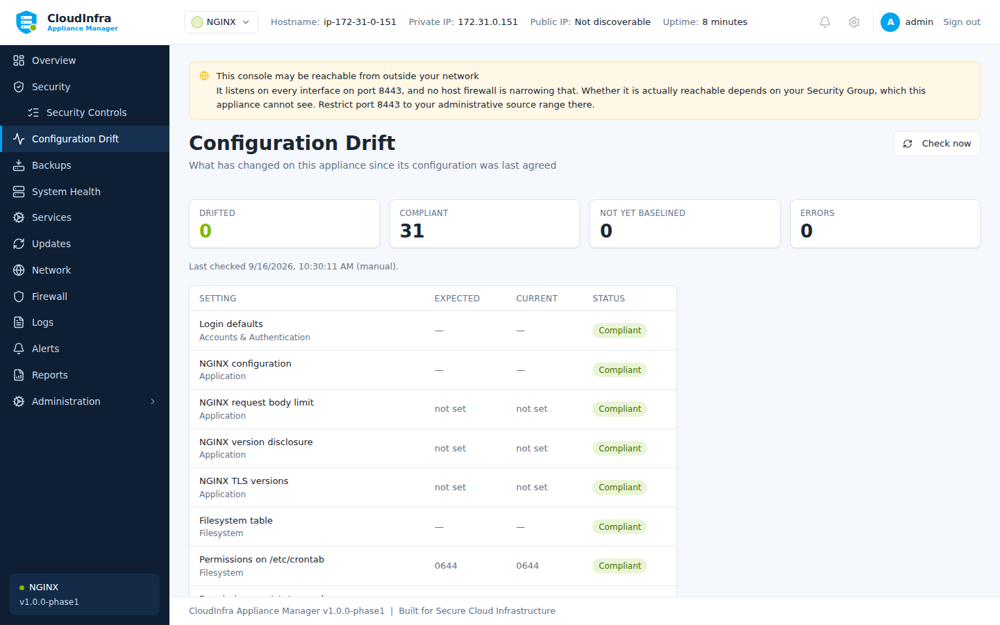

# Configuration drift

Drift is when a file the appliance watches changes without the appliance doing it — an
administrator at a terminal, a configuration management tool, or something you did not
authorise.

## Baselines

The first time a target is checked, its current state becomes the baseline. After that,
every check compares against it.

A target with no baseline reports **not yet baselined** rather than compliant. "We have never
looked" and "we looked and it matches" are different facts.

## What is watched

| Target | File |
|---|---|
| SSH daemon configuration | `/etc/ssh/sshd_config` |
| Login defaults | `/etc/login.defs` |
| Kernel parameters | `/etc/sysctl.conf` |
| Filesystem table | `/etc/fstab` |
| NGINX configuration | `/etc/nginx/nginx.conf` |
| NGINX settings | Individual directives, checked in the assembled configuration |

/// caption
Targets and their state. Anything belonging to software that is not installed reads
"not installed here" rather than failing.
///

## Reading a finding

Select any row to see what changed. The diff shows added, removed and changed lines, with
**credentials removed before they leave the host** — a proxy password or an API key in a
configuration file is masked in the diff and in any report built from it.

## Putting it back

**Restore** writes the file back to its baseline. Like remediation, it is bound to the
fingerprint of the state you reviewed: if the file changed again between you reading the
diff and pressing the button, the restore is refused rather than overwriting something you
did not see.

!!! note "A restore does not reload the service"

    Writing `sshd_config` back does not affect the running daemon until it is reloaded, and
    that gap is deliberate. A baseline captured before your own access was configured would
    lock you out the instant it took effect. The appliance restores the file and lets you
    choose when it applies.

## Accepting a change

If the change was intentional, **Accept** moves the baseline to the current state. The
target stops reporting drift and future changes are measured from here.

## Not applicable

A target belonging to software that is not installed reports **not installed here**, not an
error. An error nobody can clear teaches you that drift errors are background noise — and
the one that matters then looks exactly the same.
