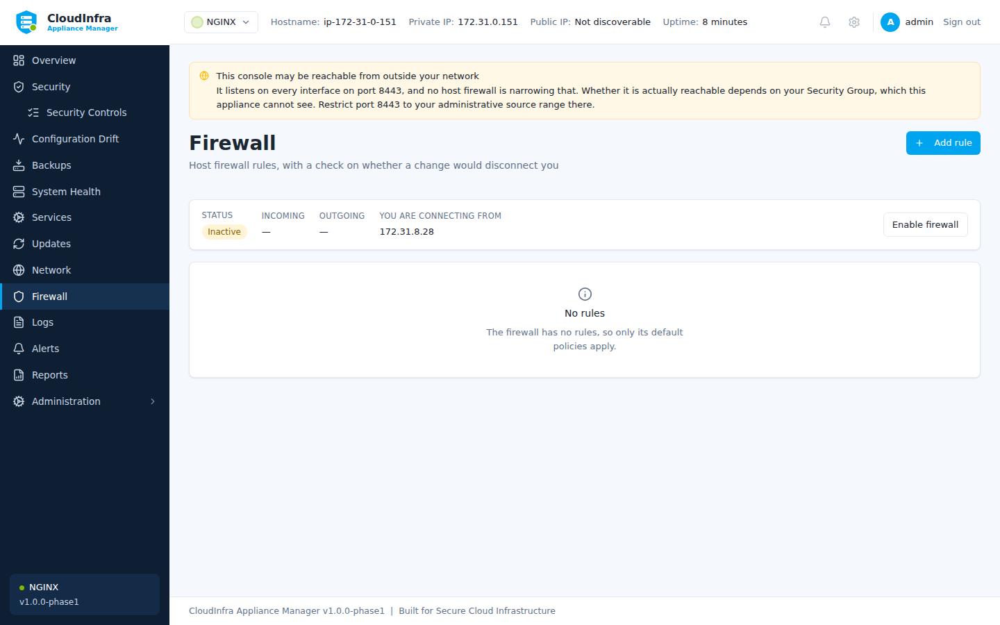

# Firewall

The appliance manages the host firewall (ufw). This is the feature most able to disconnect
you from the machine you are configuring, so it is also the most defended.

## Before you change anything

The host firewall is not your Security Group. A Security Group filters traffic before it
reaches the instance; the host firewall filters it after. The appliance can see and change
the second and cannot see the first.

If you cannot reach the console, check both.


/// caption
Rules, and a check on whether a change would disconnect you before it is made.
///

## Previewing a change

Every change is assessed before it is made:

| Severity | Meaning |
|---|---|
| **Safe** | No effect on your access |
| **Caution** | Could affect access under some conditions |
| **Lockout** | Would cut off SSH, the console, or both |

The assessment names what it would cut off, and whether it needs confirmation.

## What is refused outright

Opening the management port to every address is refused and cannot be confirmed past:

```
refusing to open the management port 8443 to every address.
Name a source address or range instead, and restrict access at the Security Group as well.
```

## The connectivity guard

A change that could disconnect you is made **behind a timer**.

1. The appliance applies the change
2. It arms a guard, and the console shows a banner
3. You confirm you can still reach the appliance
4. If you do not confirm within the window, the agent puts the rules back on its own

The reasoning is that an administrator who has just locked themselves out cannot ask for the
change to be undone — so it is undone without them.

!!! tip "Confirm promptly"

    Only one guarded change can be in flight at a time. A second is refused with *"a
    connectivity guard is already armed; confirm or let it expire first."*

## Enabling the firewall safely

Enabling a default-deny firewall with no rules is the classic self-lockout. The appliance
assesses it as **lockout** and refuses it unconfirmed.

The order that works:

1. Add a rule admitting **SSH** from your address
2. Add a rule admitting the **console port** from your address
3. Then enable

Each of those is a change you can preview first.

## Removing a rule

Deleting the rule that admits the console is assessed exactly like never adding it — as a
lockout. If you confirm it anyway, the guard covers you: the rule comes back when the timer
expires unconfirmed.
