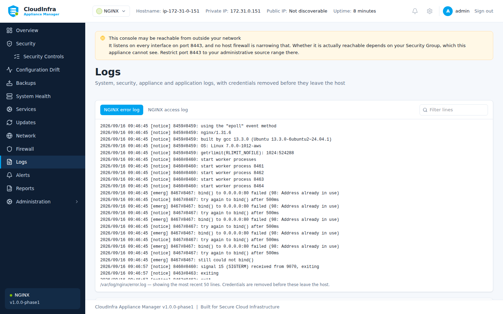

# Logs

**Logs** shows the system journal and, where a module provides them, the application's own
log files.

## System, security and appliance logs

Three scopes read from the journal:

| Scope | What |
|---|---|
| **System** | The whole journal |
| **Security** | Authentication, sudo, and security-relevant units |
| **CloudInfra** | The appliance's own services |

You can also select a single service, filter by severity, and search. The search is matched
in process rather than handed to `journalctl --grep`, because a caller-supplied regular
expression run by a root process is a denial of service waiting to happen.

/// caption
System, security and appliance logs, with the application's own log files in their own pane.
///

## Application logs

NGINX writes its access and error logs to files, not the journal — `journalctl -u nginx`
shows that the service started and stopped and nothing else. Those files appear in their own
pane.

Only the most recent lines are loaded. A line older than what is on screen is not missing, it
is simply further back than the tail.

## Credentials are removed

Every line is redacted **on the host, before it leaves it**. A request URL carrying
`?api_key=...` appears as `api_key=********`.

This applies to the journal, the application logs, diagnostics bundles and reports.

!!! note "What redaction does not do"

    It masks things that look like credentials: key-value pairs with sensitive names,
    authorization headers, bearer tokens, private key blocks, and credentials embedded in
    URLs.

    It cannot recognise a secret that looks like ordinary text. Do not treat a redacted log
    as safe to publish without reading it.

## Diagnostics bundle

**Administration → Download diagnostics** produces one archive with configuration, versions,
recent logs and health readings, redacted the same way. It is the thing to attach when
[raising a support request](../about/support.md).
