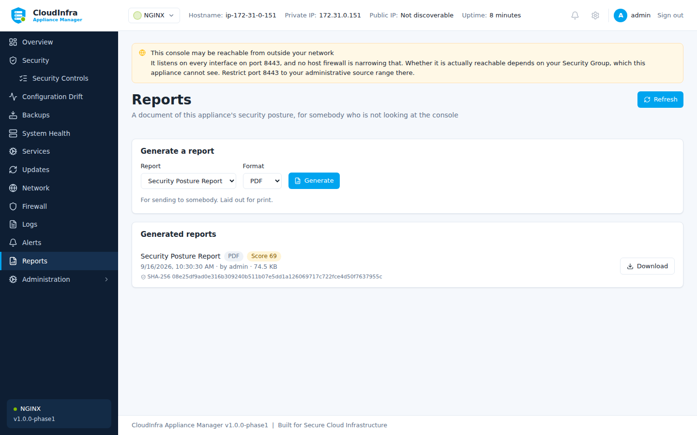

# Reports

A report is a document describing this appliance's security posture, for somebody who is not
looking at the console — an auditor, a customer, a change record.

## Generating

**Reports → Generate**, then choose a format:

| Format | For |
|---|---|
| **PDF** | Attaching to an audit or a review |
| **HTML** | Reading in a browser, or embedding |
| **JSON** | Feeding another system |
| **CSV** | Spreadsheets |

Reports are generated on the appliance and stored on it. They are not sent anywhere.

/// caption
Generated reports, ready to download. They are stored on the appliance and sent nowhere.
///

## What is in one

- The score and how it was reached
- Every control, its verdict, and the evidence behind it
- Remediations applied in the period, and their outcomes
- Drift detected, and what was done about it
- The appliance's identity and version

## Redaction

Reports are **redacted at the point they are built**, not when they are displayed. A value
masked in the console is masked in the PDF, because a report is the artefact most likely to
leave the appliance and be attached to an email.

!!! warning "Read before you send"

    Redaction recognises credential-shaped text. It cannot recognise a secret that looks
    ordinary — a hostname you would rather not publish, an internal path, a customer name in
    a comment. Treat a report as something to review before it leaves your organisation.
