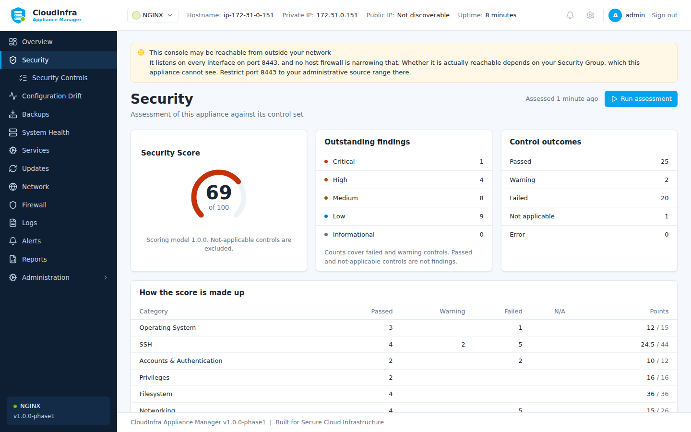

# Security assessment

An assessment reads the host and compares what it finds against a set of controls. It
changes nothing.

## Running one

From **Security**, select **Run assessment**. Assessments also run on a schedule so the
dashboard does not go stale.

Each run is a point-in-time snapshot. The appliance does not patch new readings into an old
assessment: a snapshot whose rows were measured at different moments produces a score you
cannot reproduce from any single observation.

/// caption
The score, and findings grouped by category. Each is backed by an observation.
///

## What is covered

How many controls an appliance runs depends on what is installed on it. The baseline applies
to every Linux host; each application module adds its own, and reports its controls as not
applicable when its application is absent.

| Module | Controls | Applies to |
|---|---:|---|
| Generic Linux | 43 | Every appliance, always |
| NGINX | 5 | Hosts running NGINX |
| GitLab | 9 | Hosts running GitLab CE |

So an NGINX appliance assesses 48 controls and a GitLab one 52, and the score is calculated
from the controls that apply rather than from the whole catalogue.

Across all three modules, by category:

| Category | Controls | Examples |
|---|---:|---|
| SSH | 11 | Root login, password authentication, attempt limits |
| Networking | 11 | ICMP redirects, router advertisements, exposed monitoring ports |
| Application Security | 8 | Version disclosure, security headers, transport security |
| Accounts & Authentication | 7 | Password ageing, empty passwords, sign-up restrictions |
| Filesystem | 5 | Permissions and mount options |
| Operating System | 4 | Kernel and boot settings |
| Firewall | 3 | Default policy and the management port |
| Services | 3 | Unnecessary daemons, time synchronisation |
| Privileges | 2 | sudo configuration |
| Updates | 2 | Pending security updates, unattended upgrades |
| Logging | 1 | Persistent journal |

Every control, with its rationale and what it reads, is in the
[control catalogue](../reference/controls.md) - which is generated from the packs the
appliance actually loads, so it cannot drift from what it assesses.

## Reading a verdict

Every verdict is backed by an observation. A control reports:

- **Current value** — what is set now
- **Expected value** — what the control requires
- **Source** — the file or interface it was read from
- **Rationale** — why it matters
- **Recommendation** — what to do

A control that cannot be assessed reports **error**, never **passed**. The two are different
facts, and reporting the first as the second is how a host comes to look secure because
something failed to run.

## Not applicable

Some controls do not apply to some hosts. A TLS version control on a proxy that terminates
no TLS has nothing to measure: reporting it as failed is a finding with no fix, and
reporting it as passed claims a protection that is not in place.

Not-applicable controls do not count against the score.

## Scoring

The score weights by severity — a failing high-severity control costs more than a failing
low one. Not-applicable controls are excluded entirely.

Treat it as a trend, not a target. A score of 100 on a host nobody uses means less than a
score of 80 on one serving traffic, and the individual findings are what you act on.
