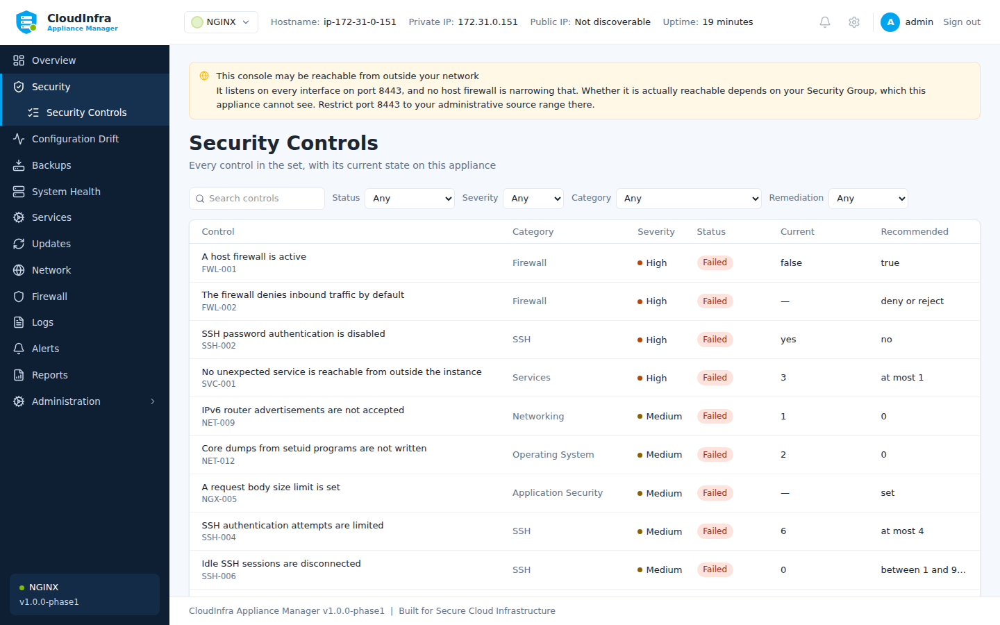

# Control catalogue

The appliance ships **57 controls** across 11 categories.

This page is generated from the control packs the appliance loads, so it describes
the controls it has rather than the ones somebody remembered shipping. Regenerate it
with `tools/generate-control-reference.py`.

Severity is how much a failure costs the score. "Remediable" means the appliance can
offer to fix it — see [Remediation](../guide/remediation.md) for why some cannot be.

/// caption
Every control in the set, with its current state on this appliance.
///

## Accounts & Authentication

| ID | Control | Severity | Remediable |
|---|---|---|---|
| `ACC-001` | No account has an empty password | critical | — |
| `ACC-003` | Password maximum age is enforced | low | — |
| `ACC-004` | Password minimum age is enforced | low | — |
| `ACC-005` | Users are warned before password expiry | info | — |
| `GTL-004` | The initial root password file has been removed | high | — |
| `GTL-005` | Sign-up is closed, or gated by administrator approval | high | — |
| `GTL-006` | Two-factor authentication is enforced | medium | — |

### ACC-001 — No account has an empty password

An account with no password can be used by anyone who reaches a login prompt. It is unauthenticated access to the appliance with whatever privileges that account holds.

*Module: `generic-linux`*

### ACC-003 — Password maximum age is enforced

A maximum password age bounds how long a credential stolen without detection stays valid. It matters most for accounts that authenticate by password rather than key.

*Module: `generic-linux`*

### ACC-004 — Password minimum age is enforced

Without a minimum age a user can cycle through a password history in seconds to return to a previous password, defeating history entirely.

*Module: `generic-linux`*

### ACC-005 — Users are warned before password expiry

Without warning, expiry locks people out at the worst moment and drives them to choose a weak password under time pressure.

*Module: `generic-linux`*

### GTL-004 — The initial root password file has been removed

The first reconfigure writes the generated root password to /etc/gitlab/initial_root_password. GitLab removes it 24 hours after that reconfigure - which, on an image, happened during the build. A copy still present on a running instance is a root credential sitting in a file, and one that may have been readable in the image before the instance ever booted.

*Module: `gitlab`*

### GTL-005 — Sign-up is closed, or gated by administrator approval

A default GitLab has sign-up enabled. On an instance reachable from the internet that means anybody can create an account; with administrator approval also switched on they cannot use it until somebody says so, which is the difference between a queue and an open door.

*Module: `gitlab`*

### GTL-006 — Two-factor authentication is enforced

GitLab holds source code, deployment credentials and CI variables, and reaches production through its runners. A password alone is what stands between a phished credential and all of it.

*Module: `gitlab`*

## Application Security

| ID | Control | Severity | Remediable |
|---|---|---|---|
| `GTL-001` | GitLab is reached over HTTPS | critical | — |
| `GTL-002` | external_url is not the shipped placeholder | high | — |
| `GTL-003` | GitLab's secrets were generated on this instance | critical | — |
| `NGX-001` | NGINX does not advertise its version | low | Yes |
| `NGX-002` | A frame-ancestors or X-Frame-Options policy is set | medium | Yes |
| `NGX-003` | Content type sniffing is disabled | low | Yes |
| `NGX-004` | Obsolete TLS versions are not offered | high | Yes |
| `NGX-005` | A request body size limit is set | medium | — |

### GTL-001 — GitLab is reached over HTTPS

external_url decides the scheme GitLab serves on, builds its clone URLs from, and redirects to. Left at http:// every password, personal access token, and git credential crosses the network in the clear, and every repository URL GitLab hands out tells clients to do the same. The shipped configuration is http://, so this is the state a GitLab is in until somebody changes it.

*Module: `gitlab`*

### GTL-002 — external_url is not the shipped placeholder

The package ships external_url as http://gitlab.example.com and GitLab believes it. Clone URLs, redirects after sign-in, webhook callbacks and emailed links are all built from it, so an instance left on the placeholder hands out addresses that resolve to somebody else's domain or to nothing at all - quietly, and only for the people receiving them.

*Module: `gitlab`*

### GTL-003 — GitLab's secrets were generated on this instance

/etc/gitlab/gitlab-secrets.json holds the keys every encrypted column in GitLab's database is encrypted with - 32 of them on a default install, covering CI/CD variables, personal access tokens and two-factor secrets. If that file is older than the instance it is on, it came from the image, and every instance launched from that image has the same keys.

*Module: `gitlab`*

### NGX-001 — NGINX does not advertise its version

server_tokens on puts the exact NGINX version in every response header and error page. It does not make the server vulnerable, but it tells an attacker which vulnerabilities to try first, and turning it off costs nothing.

*Module: `nginx`*

### NGX-002 — A frame-ancestors or X-Frame-Options policy is set

Without a framing policy any site can embed this one in an invisible frame and collect the clicks a user believes they are giving to something else. The header costs one line and closes the whole class.

*Module: `nginx`*

### NGX-003 — Content type sniffing is disabled

Without X-Content-Type-Options nosniff a browser may decide for itself what a response contains, and a file uploaded as text can be executed as script.

*Module: `nginx`*

### NGX-004 — Obsolete TLS versions are not offered

TLS 1.0 and 1.1 have no safe configuration left. A client that negotiates them is not protected, and offering them keeps that possible for no benefit; every current client supports 1.2 or better.

*Module: `nginx`*

### NGX-005 — A request body size limit is set

NGINX defaults to a 1 MB body limit, which is safe, but a configuration that raises it without bound lets one client consume disk and memory on every request. An explicit limit makes the decision visible.

*Module: `nginx`*

## Filesystem

| ID | Control | Severity | Remediable |
|---|---|---|---|
| `FS-001` | The shadow password file is not world-readable | critical | — |
| `FS-002` | The passwd file is not world-writable | critical | — |
| `FS-004` | The SSH daemon configuration is not world-writable | critical | — |
| `FS-005` | The cron table directory is not world-writable | high | — |
| `GTL-008` | The secrets file is readable only by root | high | — |

### FS-001 — The shadow password file is not world-readable

/etc/shadow holds every password hash on the appliance. If it is readable by unprivileged users, any local foothold becomes an offline cracking exercise against every account at once.

*Module: `generic-linux`*

### FS-002 — The passwd file is not world-writable

A writable /etc/passwd lets any user add an account with UID 0, which is immediate and complete privilege escalation.

*Module: `generic-linux`*

### FS-004 — The SSH daemon configuration is not world-writable

A writable sshd_config lets an unprivileged user re-enable root login or password authentication, turning a local foothold into permanent remote access.

*Module: `generic-linux`*

### FS-005 — The cron table directory is not world-writable

Anyone who can write a crontab can schedule a command as root. It is one of the most reliable persistence mechanisms on a Linux host.

*Module: `generic-linux`*

### GTL-008 — The secrets file is readable only by root

Anything that can read /etc/gitlab/gitlab-secrets.json can decrypt every encrypted column in the database. The package creates it 0600 root; anything wider is something an administrator did, usually while copying it somewhere.

*Module: `gitlab`*

## Firewall

| ID | Control | Severity | Remediable |
|---|---|---|---|
| `FWL-001` | A host firewall is active | high | — |
| `FWL-002` | The firewall denies inbound traffic by default | high | — |
| `FWL-003` | The host firewall does not open the management console to every address | critical | — |

### FWL-001 — A host firewall is active

Security Groups protect the instance at the VPC edge, but they do not protect it from other instances in the same group. A host firewall is the layer that survives an over-broad Security Group rule.

*Module: `generic-linux`*

### FWL-002 — The firewall denies inbound traffic by default

A default-allow policy means every service the appliance ever starts is exposed until someone writes a rule. Default deny inverts that: exposure becomes deliberate.

*Module: `generic-linux`*

### FWL-003 — The host firewall does not open the management console to every address

A management console reachable from the whole internet is an authentication prompt on every port scan, on every appliance the product ships. PRD Section 37 forbids opening the management port to 0.0.0.0/0, and the console refuses to create such a rule itself - but it cannot refuse one added with the ufw command, restored from an older backup, or baked into an image before that refusal existed. This control finds those. Read the scope carefully. This examines the HOST firewall only. The appliance cannot see its own AWS Security Group, so this control can prove a rule is wrong; it can never prove the console is unreachable. A pass here means the host is not the thing exposing it.

*Module: `generic-linux`*

## Logging

| ID | Control | Severity | Remediable |
|---|---|---|---|
| `SVC-003` | The system logging service is running | medium | — |

### SVC-003 — The system logging service is running

Without a running logger there is no record of what happened on the appliance, which turns any later incident into guesswork.

*Module: `generic-linux`*

## Networking

| ID | Control | Severity | Remediable |
|---|---|---|---|
| `GTL-007` | The NGINX status page is not reachable from outside | medium | Yes |
| `GTL-010` | Prometheus monitoring endpoints are not reachable from outside | medium | — |
| `NET-001` | IP forwarding is disabled | high | Yes |
| `NET-002` | ICMP redirects are not accepted | medium | Yes |
| `NET-003` | Secure ICMP redirects are not accepted | medium | Yes |
| `NET-004` | Source-routed packets are not accepted | medium | Yes |
| `NET-005` | Reverse path filtering is enabled | medium | Yes |
| `NET-006` | Suspicious packets are logged | low | Yes |
| `NET-007` | SYN cookies are enabled | medium | Yes |
| `NET-008` | ICMP redirects are not sent | low | Yes |
| `NET-009` | IPv6 router advertisements are not accepted | medium | Yes |

### GTL-007 — The NGINX status page is not reachable from outside

A default install serves nginx's status page on 0.0.0.0:8060. Anyone who can reach that port gets the instance's connection counts, and nothing outside the host needs them.

*Module: `gitlab`*

### GTL-010 — Prometheus monitoring endpoints are not reachable from outside

Omnibus runs Prometheus, alertmanager and a set of exporters. On a default install alertmanager listens on every interface, and the exporters describe the instance in detail to anyone who can reach them.

*Module: `gitlab`*

### NET-001 — IP forwarding is disabled

A host with IP forwarding enabled will route traffic between networks. On an appliance that is not a router, this turns a foothold into a pivot into private subnets the attacker could not otherwise reach.

*Module: `generic-linux`*

### NET-002 — ICMP redirects are not accepted

Accepting ICMP redirects lets anyone on the local network rewrite the appliance's routing table, which is a straightforward path to a man-in-the-middle position.

*Module: `generic-linux`*

### NET-003 — Secure ICMP redirects are not accepted

Secure redirects are only "secure" in that they come from a configured gateway; an attacker who can spoof that gateway can still rewrite routes.

*Module: `generic-linux`*

### NET-004 — Source-routed packets are not accepted

Source routing lets the sender choose the return path, which is used to bypass firewall rules and to reach hosts that should not be reachable.

*Module: `generic-linux`*

### NET-005 — Reverse path filtering is enabled

Reverse path filtering drops packets whose source address could not have arrived on that interface, which defeats a large class of address spoofing.

*Module: `generic-linux`*

### NET-006 — Suspicious packets are logged

log_martians records packets with impossible source addresses. It is the cheapest early signal that something on the network is spoofing.

*Module: `generic-linux`*

### NET-007 — SYN cookies are enabled

SYN cookies keep the appliance answering during a SYN flood instead of exhausting its connection backlog.

*Module: `generic-linux`*

### NET-008 — ICMP redirects are not sent

Only a router should send ICMP redirects. On an appliance, sending them leaks information about the network topology it can see.

*Module: `generic-linux`*

### NET-009 — IPv6 router advertisements are not accepted

Accepting router advertisements lets anyone on the link become the appliance's default IPv6 gateway, which is a man-in-the-middle position that IPv4 firewall rules do nothing to prevent.

*Module: `generic-linux`*

## Operating System

| ID | Control | Severity | Remediable |
|---|---|---|---|
| `NET-010` | Address space layout randomisation is fully enabled | high | Yes |
| `NET-011` | Kernel pointers are hidden from unprivileged users | medium | Yes |
| `NET-012` | Core dumps from setuid programs are not written | medium | Yes |
| `SVC-004` | Time synchronisation is running | medium | — |

### NET-010 — Address space layout randomisation is fully enabled

Full ASLR randomises the heap as well as stacks and libraries. It is the single cheapest mitigation against memory-corruption exploits in anything the appliance runs.

*Module: `generic-linux`*

### NET-011 — Kernel pointers are hidden from unprivileged users

Exposed kernel pointers hand an exploit the addresses it needs to defeat kernel address randomisation.

*Module: `generic-linux`*

### NET-012 — Core dumps from setuid programs are not written

A core dump from a privileged process can contain keys and passwords from its memory, written to disk where an unprivileged user may read it.

*Module: `generic-linux`*

### SVC-004 — Time synchronisation is running

A drifting clock makes log correlation across hosts unreliable and can invalidate certificate checks, so an incident timeline cannot be trusted.

*Module: `generic-linux`*

## Privileges

| ID | Control | Severity | Remediable |
|---|---|---|---|
| `ACC-002` | Only root has UID 0 | critical | — |
| `FS-003` | The sudoers file is not world-readable | high | — |

### ACC-002 — Only root has UID 0

A second account with UID 0 is root under another name. It bypasses any policy written against the username "root" and is a common, easily missed backdoor.

*Module: `generic-linux`*

### FS-003 — The sudoers file is not world-readable

/etc/sudoers describes exactly which accounts can escalate and how. Reading it tells an attacker which account to target and which commands to abuse.

*Module: `generic-linux`*

## SSH

| ID | Control | Severity | Remediable |
|---|---|---|---|
| `SSH-001` | Direct root login over SSH is disabled | critical | Yes |
| `SSH-002` | SSH password authentication is disabled | high | Yes |
| `SSH-003` | SSH empty passwords are refused | critical | Yes |
| `SSH-004` | SSH authentication attempts are limited | medium | Yes |
| `SSH-005` | SSH X11 forwarding is disabled | low | Yes |
| `SSH-006` | Idle SSH sessions are disconnected | medium | Yes |
| `SSH-007` | SSH host-based authentication is disabled | medium | Yes |
| `SSH-008` | SSH ignores user rhosts files | medium | Yes |
| `SSH-009` | SSH does not read user environment files | medium | Yes |
| `SSH-010` | SSH login grace period is short | low | Yes |
| `SSH-011` | SSH logging is verbose enough to record key fingerprints | low | Yes |

### SSH-001 — Direct root login over SSH is disabled

Direct root login removes per-administrator accountability: every action in the audit trail belongs to "root" rather than to a person, and the account name is known to every attacker, so only the password or key stands in the way.

*Module: `generic-linux`*

### SSH-002 — SSH password authentication is disabled

Password authentication exposes the appliance to credential stuffing and brute force from the whole internet. Key authentication removes that surface entirely.

*Module: `generic-linux`*

### SSH-003 — SSH empty passwords are refused

PermitEmptyPasswords allows an account with a blank password to log in over the network, which is unauthenticated access in all but name.

*Module: `generic-linux`*

### SSH-004 — SSH authentication attempts are limited

A low MaxAuthTries forces an attacker to open a new connection for every few guesses, which makes brute force slow and noisy in the logs.

*Module: `generic-linux`*

### SSH-005 — SSH X11 forwarding is disabled

X11 forwarding lets a compromised remote host reach the client's display. A headless appliance has no legitimate use for it.

*Module: `generic-linux`*

### SSH-006 — Idle SSH sessions are disconnected

An abandoned session on an unlocked workstation is a working shell on the appliance. Disconnecting idle sessions bounds that window.

*Module: `generic-linux`*

### SSH-007 — SSH host-based authentication is disabled

Host-based authentication trusts the client machine rather than the person using it, so compromising any trusted host yields access to the appliance.

*Module: `generic-linux`*

### SSH-008 — SSH ignores user rhosts files

IgnoreRhosts stops an unprivileged user placing a .rhosts file in their home directory to grant themselves passwordless access from chosen hosts.

*Module: `generic-linux`*

### SSH-009 — SSH does not read user environment files

PermitUserEnvironment lets a user set environment variables such as LD_PRELOAD in their authorized_keys or ~/.ssh/environment, which can escalate a foothold.

*Module: `generic-linux`*

### SSH-010 — SSH login grace period is short

A long grace period lets unauthenticated connections sit open, which is the resource an SSH connection-exhaustion attack consumes.

*Module: `generic-linux`*

### SSH-011 — SSH logging is verbose enough to record key fingerprints

At VERBOSE, sshd records the fingerprint of the key used for each login, which is what makes an SSH audit trail attributable to a specific key rather than a user.

*Module: `generic-linux`*

## Services

| ID | Control | Severity | Remediable |
|---|---|---|---|
| `SVC-001` | No unexpected service is reachable from outside the instance | high | — |
| `SVC-002` | The SSH daemon is running | info | — |
| `UPD-003` | The cron service is running | low | — |

### SVC-001 — No unexpected service is reachable from outside the instance

A service bound to 0.0.0.0 is reachable from anywhere a Security Group permits. This is how databases and caches end up exposed to the internet without anyone deciding to expose them.

*Module: `generic-linux`*

### SVC-002 — The SSH daemon is running

SSH is normally the only administrative route into the appliance. Recording its state makes an accidental outage visible before it becomes a lockout.

*Module: `generic-linux`*

### UPD-003 — The cron service is running

Scheduled maintenance, log rotation and automatic upgrades all depend on cron. A stopped cron silently stops each of them.

*Module: `generic-linux`*

## Updates

| ID | Control | Severity | Remediable |
|---|---|---|---|
| `UPD-001` | No security updates are pending | high | — |
| `UPD-002` | Unattended security upgrades are installed | medium | — |

### UPD-001 — No security updates are pending

Pending security updates are known, published vulnerabilities with known exploits. They are the most reliably exploited weakness on any internet-facing host.

*Module: `generic-linux`*

### UPD-002 — Unattended security upgrades are installed

An appliance is often left alone for months. Automatic security upgrades are what keep it patched when nobody is watching it.

*Module: `generic-linux`*
